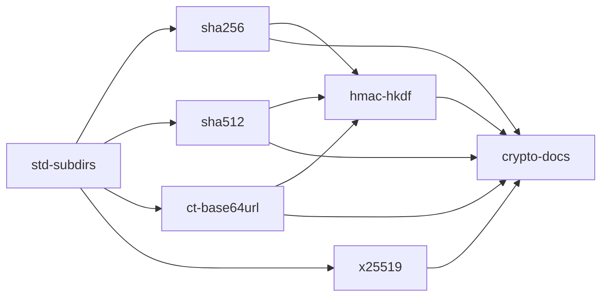

# Crypto in the standard library — WP34 K1 and K4

## Context

[WP34](../../docs/wp34-hosting-cs.md) §5 puts the network stack in `std/` (decision S2), with crypto in pure Nish (S1). Lane **K1** is SHA-256, SHA-384, HMAC, HKDF, a constant-time compare and base64url; lane **K4** is X25519 on 25.5-bit limbs in `i64`. Both are pure functions with published answers, so they need no socket and no new builtin.

A nested specifier already resolves: `nish/crypto/probe` compiled, linked and ran against `std/crypto/probe.ts` in both number modes (checked during planning). What does not yet follow a subdirectory is the suite: every `tests/run.js` check that walks `std/` reads only its top level ([`tests/run.js`](../../tests/run.js) lines ~1620, ~7108, ~9059, ~9346, ~9745), so a `std/crypto/` module would skip the zero-warning performance gate, the `tsc` library check and the packaging checks.

## Approach

- **One module per primitive, under `std/crypto/`**, imported as `nish/crypto/<name>`. A lane owns its own files and nothing else.
- **Written from the specifications**: FIPS 180-4, RFC 2104, RFC 4231, RFC 5869, RFC 4648, RFC 7748. Nothing is ported from an existing implementation, so no third-party notice is needed. If a worker does follow an implementation's structure (TweetNaCl or ref10 for the field arithmetic), that is a copy under [licensing.md](../licensing.md), and the x25519 stage owns `THIRD_PARTY_NOTICES.md` for that reason alone.
- **Buffers are `u8[]`**, and a window is `(buf, off, len)` as WP34 N2 spells it. Lengths and offsets are `i32`. A digest is a fresh `u8[]`.
- **Streaming is required**, not a nicety: TLS 1.3 (lane T1) hashes a transcript incrementally and takes intermediate hashes, so every hash has `update`, `copy` and `digest`.
- **Constant time before N6.** N6's `ctSelect` and `ctEq` builtins and their disassembly check are not built. These modules are written branch-free by masking (`mask = 0 - bit`, `x ^= mask & (x ^ y)`), and never index or branch on a secret. That is the discipline N6 will verify; this run does not claim it is verified.
- **Proof is a `tests/link/crypto_<name>/` program** (`main.ts`, `expected.out`, `expected.code`), which `npm test` discovers by itself, using [`std/testing`](../../std/testing.ts)'s `Suite`. Each test carries its own small hex helper, so no module stage waits on another for test plumbing. Vectors are cited by RFC section in a comment beside each one.
- **Every module compiles with zero diagnostics in `--number-mode i32` and `f64`** — the performance gate enforces it once `std-subdirs` has merged, which is why every module stage merges after it.

### Dependencies



Arrows into `sha256`, `sha512`, `ct-base64url` and `x25519` are merge-order edges only: those stages start at once. `hmac-hkdf` starts once `sha256`, `sha512` and `ct-base64url` have merged, because it calls them. `crypto-docs` starts last.

## std-subdirs

**Owns:** `tests/run.js`

- One helper, e.g. `stdModuleFiles()`, answering every `.ts` under `std/` recursively as `std/<path>` with `/` separators, sorted. Use it in the performance gate (~1620), the `tsc` library check (~9059), the npm-pack check (~9346) and the platform-package check (~9745).
- **Leave the `src/std-modules.ts` agreement check (~7108) on the top level.** Making it recursive now would force every module stage to edit the same literal; `crypto-docs` makes it recursive once the modules exist.
- Prove the walker: a check that the helper finds a file in a nested fixture directory (a temp dir, or a `root` parameter), so the claim does not rest on `std/crypto/` existing.

## sha256

**Owns:** `std/crypto/sha256.ts`, `tests/link/crypto_sha256*/**`

```ts
export const SHA256_SIZE: i32 = 32
export const SHA256_BLOCK: i32 = 64
export class Sha256 {
  update(data: u8[], off: i32, len: i32): void
  copy(): Sha256          // an independent hasher at the same point — the transcript-hash case
  digest(): u8[]          // 32 bytes; the hasher may not be updated afterwards
}
export const sha256 = (data: u8[]): u8[]
```

Vectors (FIPS 180-4 examples and NIST CAVP `SHA256ShortMsg`): the empty message, `"abc"`, the 448-bit and 896-bit messages, one million `a`, and messages of 55, 56, 63, 64 and 65 bytes (the padding boundaries). Streaming: one message fed at every split point, and in 1-byte chunks, equals the one-shot digest; a `copy()` taken mid-stream digests the prefix and leaves the original's final digest unchanged. Report 1 MiB throughput in the PR body.

## sha512

**Owns:** `std/crypto/sha512.ts`, `tests/link/crypto_sha512*/**`

The same shape as `sha256` — `Sha512`, `Sha384`, `sha512()`, `sha384()`, `SHA512_SIZE = 64`, `SHA384_SIZE = 48`, `SHA512_BLOCK = 128` — on `u64` words with a 128-bit length. SHA-384 is SHA-512 with its own initial values, truncated. Vectors: empty, `"abc"`, the 896-bit message and one million `a` for both widths, and lengths 111, 112, 127, 128 and 129 bytes. The same streaming and `copy()` checks. Report 1 MiB throughput in the PR body.

## ct-base64url

**Owns:** `std/crypto/ct.ts`, `std/crypto/base64url.ts`, `tests/link/crypto_ct*/**`, `tests/link/crypto_base64url*/**`

```ts
// ct.ts — named apart from N6's future ctEq builtin
export const timingSafeEqual = (a: u8[], b: u8[]): boolean          // false on unequal lengths; otherwise no early exit
export const timingSafeEqualAt = (a: u8[], aOff: i32, b: u8[], bOff: i32, len: i32): boolean
// base64url.ts — RFC 4648 §5, unpadded, as JWS and the relay's grants use it
export const base64urlEncode = (data: u8[]): string
export const base64urlDecode = (text: string): u8[] | null
```

`timingSafeEqual` ORs the XOR of every byte pair and tests once at the end. `base64urlDecode` answers `null` for `=` padding, any character outside `A-Z a-z 0-9 - _`, a length of 1 mod 4, and non-zero trailing bits (so that each byte string has exactly one encoding). Vectors: RFC 4648 §10 (`""`, `f` … `foobar`) without padding, bytes that exercise `-` and `_` (`fb ff`, `ff fe`), and every refusal above.

## hmac-hkdf

**Owns:** `std/crypto/hmac.ts`, `std/crypto/hkdf.ts`, `tests/link/crypto_hmac*/**`, `tests/link/crypto_hkdf*/**`

```ts
export class HmacSha256 { constructor(key: u8[]); update(data: u8[], off: i32, len: i32): void; digest(): u8[] }
export class HmacSha384 { /* same */ }
export const hmacSha256 = (key: u8[], data: u8[]): u8[]
export const hmacSha384 = (key: u8[], data: u8[]): u8[]
export const hmacSha256Verify = (key: u8[], data: u8[], tag: u8[]): boolean   // through timingSafeEqual
export const hmacSha384Verify = (key: u8[], data: u8[], tag: u8[]): boolean
export const hkdfExtractSha256 = (salt: u8[], ikm: u8[]): u8[]
export const hkdfExpandSha256 = (prk: u8[], info: u8[], length: i32): u8[] | null   // null past 255 * 32
export const hkdfExtractSha384 = (salt: u8[], ikm: u8[]): u8[]
export const hkdfExpandSha384 = (prk: u8[], info: u8[], length: i32): u8[] | null   // null past 255 * 48
```

A key longer than the block is hashed first; an empty salt is `HashLen` zero bytes. Vectors: RFC 4231 test cases 1–7 for SHA-256 and SHA-384 (case 5 compared on its first 128 bits); RFC 5869 A.1–A.3 (PRK and OKM); `expand` at exactly 255 × HashLen and refused one byte past it, for both hashes; `verify` true on the right tag and false on a one-bit flip and on a truncated tag. HKDF-Expand-Label belongs to TLS (lane T1) and is not built here.

## x25519

**Owns:** `std/crypto/x25519.ts`, `tests/link/crypto_x25519*/**`, `THIRD_PARTY_NOTICES.md` (only if the field arithmetic turns out to be a copy)

```ts
export const X25519_SIZE: i32 = 32
export const x25519 = (scalar: u8[], u: u8[]): u8[] | null   // null unless both are 32 bytes
export const x25519Base = (scalar: u8[]): u8[] | null        // x25519(scalar, 9)
```

- Field elements are ten limbs of alternately 26 and 25 bits in `i64` (WP34 K4), so every product and every sum of products fits in `i64` without wide multiplication; say in a comment beside `mul` why the bound holds.
- Decoding masks the top bit of `u` (RFC 7748 §5); the scalar is clamped (clear bits 0–2 and 255, set bit 254). Inversion is `z^(p-2)`, a fixed addition chain.
- The ladder swaps with a masked conditional swap, never an `if` on a scalar bit, and runs all 255 steps.
- An all-zero output is returned, not refused: RFC 7748 §6.1 leaves the check to the protocol, and TLS 1.3 (T1) is where it is made. Say so in the doc comment.

Vectors: RFC 7748 §5.2's two single computations, its iterated vector after 1 and 1,000 iterations, and §6.1's Alice and Bob public keys and shared secret. Run the 1,000,000-iteration vector once by hand and report the result and time in the PR body; it is not in the suite.

## crypto-docs

**Owns:** `src/std-modules.ts`, `docs/LANGUAGE.md`, `std/README.md`, `docs/wp34-hosting-cs.md`, `tests/run.js`, `tests/cases/reject_std_unknown_module*`, `llms.txt`

- `stdModuleNames()` lists the nested modules by their specifier tail, e.g. `…, crypto/base64url, crypto/ct, crypto/hkdf, crypto/hmac, crypto/sha256, crypto/sha512, crypto/x25519, json, …`, in the order the agreement check sorts; the LANGUAGE.md sentence quoting it follows. It is a string literal, so the rolling freeze is not touched.
- Make the agreement check (~7108 in `tests/run.js`) use the recursive walker from `std-subdirs`.
- `std/README.md`: a `nish/crypto` section, one row per module, the constant-time caveat (branch-free by construction, verified once N6 lands), and the RFC each module reproduces.
- `docs/wp34-hosting-cs.md`: mark K1 and K4 as landed, with the PRs, and what remains of each lane (Wycheproof vectors; N6's disassembly check).
- `llms.txt`: add `nish/crypto` to its standard-library line if that line enumerates modules.

## Out of scope

- N6's `ctSelect` / `ctEq` builtins and the disassembly and dudect checks. This run writes branch-free code; it does not prove it.
- Wycheproof vector files. Vendoring them is a third-party file with its own notice; it is a follow-up for K1 and K4.
- SHA-1, SHA-224, SHA-512/256, HKDF-Expand-Label, Ed25519, and lanes K2, K3, K5, K6.
- Running these modules under Node through `runtime/nish.mjs` (WP33); unsigned wrap-around under Node is WP33's problem.
- Any change to `src/` beyond the listing literal, and any new builtin.

## Tests

Each module stage adds one or more `tests/link/crypto_<name>/` programs, mirroring [`tests/link/std_text`](../../tests/link/std_text/main.ts) and [`tests/link/std_testing`](../../tests/link/std_testing): `main.ts` drives a `Suite`, `expected.out` holds its `PASS` lines, `expected.code` is `0`. A vector is compared as a hex string so a failure prints both sides. At least one check per module is a **negative**: a wrong-length input answering `null`, a flipped bit failing `verify`, malformed base64url refused.

## Verification

Per stage, its `verification` line; before any PR opens, the repository's own definition of done: `npm run check`, `npm run lint`, and `npm test` **undegraded** (LLVM 18 present, no `DEGRADED:` banner, skip count stated in the PR body). If `npm run build` fails with hundreds of syntax errors, the seed is stale: `bash scripts/fetch-seed.sh --force`.
