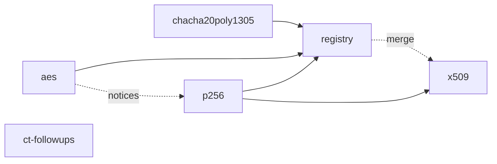

# Crypto in the standard library — WP34 K2, K3, K5 and K6

## Context

[WP34](../../docs/wp34-hosting-cs.md) §5 puts the network stack in `std/` (S2) with crypto in pure Nish (S1). K1 (hashes, HMAC, HKDF, `ct`, base64url) and K4 (X25519) landed in #287–#299. WP34 N6 (#310) has since added the `ctSelect` and `ctEq` builtins and [`tests/ct-asm.js`](../../tests/ct-asm.js), which compiles each `tests/cases/ct_asm_*.ts` for x86-64 and aarch64 and refuses any conditional branch, any call and any secret-addressed load or store in the functions a `// ct-check:` line names. This run adds the remaining symmetric and signature primitives TLS 1.3 and QUIC need — K2, K3 and K5 — puts them and X25519 under that check, and, as a stretch, K6's certificates.

## Approach

- **Layout exactly as K1/K4.** One module per primitive under `std/crypto/`, imported as `nish/crypto/<name>`. Its proof is `tests/link/crypto_<name>/` (`main.ts`, `expected.out`, `expected.code`) and a `crypto_<name>_f64/` twin with `args` = `--number-mode f64` that re-runs a subset, as [`tests/link/crypto_x25519_f64`](../../tests/link/crypto_x25519_f64/main.ts) does. Tests use [`std/testing`](../../std/testing.ts)'s `Suite` and cite each vector by section. Copy the hex helper into the slice's own test directory rather than importing another slice's.
- **The module rules of [`std/README.md`](../../std/README.md#writing-a-module-here) hold**: widths spelled, lengths through `toI32` once per function, functions as `const` arrows, private helpers prefixed with the module's name (a flat symbol namespace), loop bounds literal where the compiler must prove indexing, signed `i64` overflow is undefined (unsigned wraps). A bad input length answers `null`, never a panic; a failed authentication answers `null`.
- **Constant time.** No branch on, and no index by, a secret. Use `ctSelect` and `ctEq` (builtins over `u32`/`u64`, [`docs/LANGUAGE.md`](../../docs/LANGUAGE.md#constant-time-ctselect-and-cteq)) for selection and comparison, and `timingSafeEqual` from `nish/crypto/ct` or `ctEq` over an ORed difference for a tag compare. Each module's header says what is verified by disassembly and what is discipline.
- **Disassembly fixtures.** A `ct_asm_*` fixture is a golden case in `tests/cases/` (`.ts`, `.ll`, `.args` with `--unchecked-indexing`), read by `tests/ct-asm.js` under the rules at the head of that file. The check refuses *every* conditional branch, loop back-edges included, so a fixture names straight-line cores — one Poly1305 block, one AES round, one field multiply, one ladder step — not a 255-step loop. The fixture's functions must be the module's own code: import the module and export thin wrappers if clang inlines them into straight-line code, and otherwise copy the core verbatim with a comment naming the module function it mirrors and a check (a `tests/link` assertion that the two agree on inputs) so the copy cannot drift. Module slices may not edit `tests/ct-asm.js`; if its model cannot read a fixture, say so in the PR and the lead routes it.
- **Test vectors are data, and Wycheproof's are Apache-2.0.** Embed only the cases used, as Nish source in `tests/link/crypto_wycheproof/` (a directory with no `main.ts`, which the link harness does not run), each file headed by the upstream notice, with the licence text at `tests/link/crypto_wycheproof/LICENSE-wycheproof` and rows in `THIRD_PARTY_NOTICES.md`, per [licensing.md](../licensing.md). The `aes` slice creates that directory, its licence text and the notice section; `p256` adds its own vector file and rows after `aes` merges. Say in the test output how many cases ran and how many were filtered out, and why (AES-192 keys, non-128-bit tags, a curve other than P-256).
- **Measured.** Each module PR reports throughput on the worker's box beside Node's `crypto` on the same box — MB/s at 16 KiB messages for the AEADs, operations per second for P-256 key generation, sign and verify — in a `Measured:` trailer and a table in the body. Build with `--profile speed`.
- **Coverage is substituted**, as in the K1/K4 run: every exported function is exercised by a vector or a refusal in its `tests/link/crypto_*` program. There is no coverage command in this repository.

### Out-of-lane lines

This lane may not edit `src/**`, but `tests/run.js` holds `src/std-modules.ts`'s `stdModuleNames` literal to the files in `std/`, so a module cannot land without its name in that one string. Each module slice therefore adds exactly its own name to that literal, alphabetically, and nothing else in `src/`; a slice that merges second resolves the one-line conflict by merging `main` in. The literal is not in any self-golden. `registry` edits one filter in `tests/run.js` (#306's second ask). Both are owner-approved exceptions recorded in the tracking issue.

### Dependencies



`chacha20poly1305`, `aes`, `p256` and `ct-followups` start at once. `p256` merges after `aes` (the shared Wycheproof notice). `registry` starts once the three module slices have merged or escalated. `x509` starts once `p256` has merged, and merges after `registry`.

## chacha20poly1305

**Owns:** `std/crypto/chacha20poly1305.ts`, `tests/link/crypto_chacha20poly1305*/**`, `tests/cases/ct_asm_chacha20poly1305*`, and its name in `src/std-modules.ts`'s `stdModuleNames`.

```ts
export const CHACHA20_KEY_SIZE: i32 = 32
export const CHACHA20POLY1305_NONCE_SIZE: i32 = 12
export const POLY1305_TAG_SIZE: i32 = 16
export const chacha20Block = (key: u8[], counter: u32, nonce: u8[]): u8[] | null       // 64 bytes, RFC 8439 §2.3
export const chacha20 = (key: u8[], counter: u32, nonce: u8[], data: u8[]): u8[] | null // §2.4, XOR with the stream
export const poly1305 = (key: u8[], msg: u8[]): u8[] | null                              // §2.5, one-time key
export const chacha20Poly1305Seal = (key: u8[], nonce: u8[], aad: u8[], plaintext: u8[]): u8[] | null // ciphertext || tag
export const chacha20Poly1305Open = (key: u8[], nonce: u8[], aad: u8[], sealed: u8[]): u8[] | null    // null on a bad tag
export const chacha20HeaderMask = (key: u8[], sample: u8[]): u8[] | null                  // RFC 9001 §5.4.4, 5 bytes
```

Written from RFC 8439. Poly1305 on five 26-bit limbs in `u64` (or another layout the header justifies); the final `h + s` and the reduction by masking, not a comparison. `open` computes the tag over the received ciphertext and compares it in constant time before decrypting anything it returns.

Vectors: RFC 8439 §2.1.1 quarter round, §2.3.2 block, §2.4.2 encryption, §2.5.2 Poly1305, §2.6.2 key generation, §2.8.2 AEAD, and Appendix A.1–A.5 (including A.3's Poly1305 edge cases and A.5's decryption). RFC 9001 A.5: the ChaCha20 short-header packet's mask and the protected header. Refusals: a one-bit flip in the tag, the ciphertext and the AAD each answer `null`; wrong key, nonce and sample lengths answer `null`; a sealed input shorter than the tag answers `null`.

Fixture `ct_asm_chacha20poly1305`: one Poly1305 block (multiply and partial reduction), the final reduction, and the tag compare, secret = key, accumulator and tag contents.

## aes

**Owns:** `std/crypto/aes.ts`, `tests/link/crypto_aes*/**`, `tests/link/crypto_wycheproof/LICENSE-wycheproof`, `tests/link/crypto_wycheproof/aes*`, `tests/cases/ct_asm_aes*`, `THIRD_PARTY_NOTICES.md` (the Wycheproof section and its rows), and its name in `stdModuleNames`.

```ts
export const AES_BLOCK: i32 = 16
export const AES_GCM_TAG_SIZE: i32 = 16
export class AesKey { /* the expanded, bitsliced round keys, and the GHASH key H */ }
export const aesKey = (key: u8[]): AesKey | null                          // 16 or 32 bytes; anything else null
export const aesEncryptBlock = (key: AesKey, block: u8[]): u8[] | null    // one ECB block
export const aesGcmSeal = (key: AesKey, iv: u8[], aad: u8[], plaintext: u8[]): u8[] | null  // ciphertext || 16-byte tag
export const aesGcmOpen = (key: AesKey, iv: u8[], aad: u8[], sealed: u8[]): u8[] | null
export const aesHeaderMask = (key: AesKey, sample: u8[]): u8[] | null    // RFC 9001 §5.4.3, 5 bytes
```

**Bitsliced, not table-driven.** The S-box is a Boolean circuit (Boyar–Peralta's published circuit is an idea and needs a citation only), evaluated on bitsliced state in `u32` or `u64` words. No `SBOX[x]` lookup anywhere, key schedule included. GHASH multiplies in GF(2^128) without a table: a masked shift-and-add, or integer multiplication with holes. **Following BearSSL's `aes_ct` / `aes_ct64` / `ghash_ctmul` structure is a copy** under [licensing.md](../licensing.md) (MIT: notice in the file, its licence text beside it, a row, and the origin in the PR body); writing from the papers is not. Either is acceptable; the PR says which. The IV may be any non-zero length (SP 800-38D §7.1), so every 128- and 256-bit Wycheproof case with a 128-bit tag applies.

Vectors: FIPS 197 Appendix C.1 and C.3 single blocks; the GCM specification's test cases 1–6 (AES-128) and 13–18 (AES-256) that SP 800-38D's validation uses; RFC 9001 A.2 and A.3 header-protection masks (the client and server Initial packets' `hp` keys and samples). Wycheproof `aes_gcm_test.json`: every case with a 128- or 256-bit key and a 128-bit tag, checking `valid` cases decrypt and re-encrypt exactly and `invalid` cases answer `null`. Refusals: key lengths 0, 15, 24, 33; a flipped tag, ciphertext and AAD bit; an empty IV.

Fixture `ct_asm_aes`: one full round on bitsliced state (S-box circuit, ShiftRows, MixColumns, AddRoundKey), one GHASH multiply, and the tag compare.

## p256

**Owns:** `std/crypto/p256.ts`, `std/crypto/LICENSE-fiat-crypto` (fiat-crypto's `LICENSE-MIT`, verbatim), `tests/link/crypto_p256*/**`, `tests/link/crypto_wycheproof/ecdsa*`, `tests/cases/ct_asm_p256*`, `THIRD_PARTY_NOTICES.md` (the fiat-crypto section and the p256 and Wycheproof-ECDSA rows, added after `aes` merges), and its name in `stdModuleNames`.

```ts
export const P256_SCALAR_SIZE: i32 = 32
export const P256_POINT_SIZE: i32 = 65           // uncompressed SEC1: 0x04 || X || Y
export const P256_SIGNATURE_SIZE: i32 = 64       // r || s, big-endian; DER is K6's
export const p256PublicKey = (priv: u8[]): u8[] | null                            // null for 0 or >= n
export const p256Sign = (priv: u8[], digest: u8[]): u8[] | null                   // RFC 6979 k from HMAC-SHA-256
export const p256Verify = (pub: u8[], digest: u8[], sig: u8[]): boolean
export const p256SignSha256 = (priv: u8[], msg: u8[]): u8[] | null
export const p256VerifySha256 = (pub: u8[], msg: u8[], sig: u8[]): boolean
```

**A port.** The field (mod p) and scalar (mod n) arithmetic is fiat-crypto's `fiat-c/src/p256_32.c` and `p256_scalar_32.c` — Montgomery form on eight `u32` limbs with `u64` products — translated to Nish with fiat's function names kept under a `p256Fiat` prefix. The file carries the upstream notice (fiat-crypto, its copyright line, "used under the MIT licence" and the path of its text), `std/crypto/LICENSE-fiat-crypto` holds fiat-crypto's `LICENSE-MIT` verbatim — it ships, because `package.json`'s `files` carries `std/` — and `THIRD_PARTY_NOTICES.md` gets a notice section and a row. The PR body names the upstream commit, both files, and that the MIT option was taken — decided by the owner at sign-off: it is on licensing.md's allowed list as written (BSD-1-Clause is not). The point arithmetic is Renes–Costello–Batina's complete formulas for a = −3 (a paper: cite it), so addition has no exceptional case to branch on. Scalar multiplication by a secret is a fixed-window ladder that reads every table entry and keeps one by `ctSelect`; verification's `u1·G + u2·Q` may be variable time, since nothing in it is secret. Point decoding checks the point is on the curve and refuses the identity.

Vectors: RFC 6979 A.2.5 — the key pair, and for SHA-256 the `k`, `r` and `s` of "sample" and "test"; `p256PublicKey` of A.2.5's private key. Wycheproof `ecdsa_secp256r1_sha256_test.json` (DER signatures: carry a minimal DER-to-`r || s` reader in the test, not the module, since DER is K6's): every case, `valid` verifies, `invalid` does not, `acceptable` recorded as whichever the module answers and counted. Refusals: private key 0 and n; a public key off the curve, the identity, and a wrong length; `r` or `s` of 0 or ≥ n.

Fixture `ct_asm_p256`: fiat's field multiply and square, the conditional move, the scalar-field multiply, and one fixed-window step (table scan by `ctSelect`, a doubling and an addition).

## ct-followups

**Owns:** `tests/link/crypto_sha512*/**`, `tests/cases/ct_asm_x25519*`, `std/crypto/x25519.ts` (its header comment only), `tests/ct-asm.js`, `tests/ct-timing.js`, `.github/workflows/ct-timing.yml`, and in `docs/LANGUAGE.md` one sentence in the "Constant time" section.

- **#305.** FIPS 180-4's 448-bit message `abcdbcdecdefdefgefghfghighijhijkijkljklmklmnlmnomnopnopq` for SHA-384 and SHA-512, with the digests #305 gives, in `tests/link/crypto_sha512`'s suite and both `expected.out` files.
- **X25519 under the check.** `ct_asm_x25519`: the field multiply, the conditional swap and one ladder step, secret = the scalar bit and the limb contents. Then `x25519.ts`'s header and the README caveat say which parts are verified (the README line is `registry`'s).
- **#316.** `tests/ct-timing.js`: a dudect harness (Welch's t-test between a fixed and a random secret class, interleaved in random order, cropped at percentiles as dudect does) that compiles each `tests/cases/ct_asm_*.ts` natively with a small driver and times every function its `// ct-check:` lines name, so a new fixture joins without editing the harness. `--quick` runs a few thousand samples for a smoke run; the default runs enough for |t| to mean something. It exits non-zero only on |t| above dudect's threshold (4.5). `.github/workflows/ct-timing.yml`: `schedule` weekly and `workflow_dispatch`, on `ubuntu-latest` and `ubuntu-24.04-arm`, building the compiler the way `ci.yml` does, and on failure opening or commenting on one issue rather than failing a pull request. It never runs from `npm test` and is not a required check. One sentence in LANGUAGE.md's "Constant time" section says what the job measures and what it cannot promise.

## registry

**Owns:** `.github/workflows/release.yml` (the three presence-gate `for f in` lines and the comment and echo beside them), `tests/run.js` (the release-gate check's nested-module filter only), `std/README.md`, `docs/LANGUAGE.md` (the library list and the `nish/crypto` rule), `llms.txt`, `docs/wp34-hosting-cs.md` (§5a).

- **#306.** Name every `std/crypto/*.ts` that exists when this slice runs — K1, K4 and whatever of K2, K3 and K5 merged — in all three presence gates, and `std/crypto/LICENSE-fiat-crypto` beside `p256.ts` (the licence check requires a gate naming a shipped copy to name its licence). Drop the `.filter((m) => !m.includes("/"))` and its `TODO(WP34)`, so the existing check holds every future nested module to the gates. Fix the echoed count.
- **Listings.** `std/README.md`'s `nish/crypto` table gains a row per new module (what it exports, what it reproduces) and its three rules become four or five: the constant-time rule now says what `tests/ct-asm.js` verifies per module. `docs/LANGUAGE.md`'s module list and `nish/crypto` rule, `llms.txt`'s library line and WP34 §5a's Landed table (K2, K3, K5; what is left) follow, as #299 did.

## x509

Stretch: starts after `p256` merges; merges after `registry`.

**Owns:** `std/crypto/x509.ts`, `tests/link/crypto_x509*/**`, `tests/cases/ct_asm_x509*`, and its own line in each of `stdModuleNames`, the three `release.yml` presence gates, `std/README.md`, `docs/LANGUAGE.md`'s list and `llms.txt`.

```ts
export const derToPem = (der: u8[], label: string): string
export const pemToDer = (pem: string, label: string): u8[][] | null          // every block with that label, in order
export const x509ParseP256PrivateKey = (pem: string): u8[] | null           // SEC1 "EC PRIVATE KEY" or PKCS#8 "PRIVATE KEY"
export class X509Certificate { der: u8[]; tbs: u8[]; publicKey: u8[]; notBefore: i64; notAfter: i64; signature: u8[] }
export const x509ParseChain = (pem: string): X509Certificate[] | null
export const x509MintSelfSigned = (priv: u8[], commonName: string, notBeforeMs: i64, days: i32, serial: u8[]): u8[] | null // DER; null for days < 1 or > 14
export const x509CertificateHash = (der: u8[]): u8[]                        // SHA-256 of the DER, for serverCertificateHashes
```

Written from RFC 5280, X.690 (DER) and RFC 7468 (PEM, standard base64 with padding — not `base64url`). The signature is ECDSA-with-SHA256 over the TBS certificate, `r || s` from `p256SignSha256` wrapped in DER. Time is a parameter so the golden is deterministic; the caller passes `Date.now()` and a serial from `crypto.getRandomValues`. The golden DER is minted from RFC 6979 A.2.5's key at a fixed time; the worker checks by hand, and states in the PR, that `openssl x509 -inform DER -text` reads it (ECDSA P-256, validity ≤ 14 days, the CN) and that `openssl verify -CAfile` of it against itself passes, and that `openssl x509 -outform DER | sha256sum` equals `x509CertificateHash`. Parsing: a chain made by `openssl req -x509` (checked in as fixture text), a truncated DER, a wrong PEM label and a non-minimal length each answer `null`.

## Out of scope

- AES-192, AES-CBC/CTR as exported modes, ChaCha20 with a 64-bit nonce, XChaCha20, P-384, EdDSA, RSA.
- TLS 1.3's HKDF-Expand-Label and QUIC's packet protection (T1, Q1).
- Wycheproof for HMAC, HKDF and X25519 (named in WP34 §5a as K1/K4 debt): filed as its own issue, not widened into this run.
- Any change to the compiler, the runtime or `tests/ct-asm.js`'s model beyond what `ct-followups` needs; a compiler bug or a missing builtin is filed with a minimal Nish reproduction and worked around in `std/` if a clean workaround exists.

## Verification

Per slice, the stage's `verification` command; before any PR: `npm run check`, `npm run lint`, and a full `npm test` that is undegraded (no `DEGRADED:` banner, only the `wasi` skip), with the pass/fail/skip line in the PR body. `node tests/run.js third-party-licence` for any slice touching notices; `node docs/check-links.mjs` for any slice touching Markdown.
