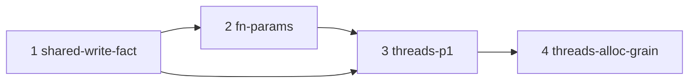

# WP29 P1 — the data-parallel call

## Context

[docs/MASTER_PLAN.md](../../docs/MASTER_PLAN.md) "Next" item 1 is [wp29](../../docs/wp29-thread-surface.md) §4.1's stage P1: `parallelMapInto(src, dst, f)` and `parallelReduce(src, f, identity)`, over the partitioner [runtime/runtime_parallel.c](../../runtime/runtime_parallel.c) already provides (wp20 §8d). It is the largest measured speedup left, 3.96x on four cores. It needs [wp23](../../docs/wp23-language-surface.md) §6's compile-time function parameter: a callee the checker can name, monomorphised per callee, and no other kind of callee (wp29 §6).

Today none of the syntax exists. There is no function-type or arrow-expression node ([self/nodes.ts](../../self/nodes.ts), `N_COUNT = 61`). `(x: T) => U` fails in `parsePrimaryType`, and a function type is `Unsupported type` ([self/annotations.ts:187](../../self/annotations.ts)).

## Approach — decisions a reviewer should check

- **Purity is a new fact, not `readnone`/`readonly`.** Every panic, trap and arena allocation is `EFFECT_WRITE` today ([self/runtime.ts](../../self/runtime.ts), [self/attributes.ts](../../self/attributes.ts)). Used literally, the rule would refuse any body with a bounds check or an integer division. A panic `_exit`s and writes no user memory, so stage 1 records a *shared write* that leaves out panics, traps and allocation, and names the site.
- **Purity alone still races.** A read-only body can reach `dst` through its argument, for example `T = Row { cells: f64[] }`. Stage 3 adds a reachability rule: `parallelMapInto` is rejected if an array of `dst`'s element type can be reached from `T`, and the message names the field path.
- **`nish/threads` is ordinary Nish.** `STD_PREFIX` resolves it to `std/threads.ts` ([self/compilation.ts](../../self/compilation.ts)). The module is real source, and its bodies are the sequential semantics, so it typechecks under `npm run check` and runs under Node. The compiler recognises the two templates by module and name and replaces only the instance's lowering. P1 needs no `declare global`, no `Disposable` and no `using`.
- **Reduce is deterministic** (wp29 §11). It keeps an *identity*, not an initial value.
  - The input is split into K = min(64, ceil(len/BLOCK)) blocks. Each block is folded from the identity, and the partial results are combined in order.
  - The sequential source does the same blocking, so the result has the same bits on 1 core or 64, with or without threads, and under Node.
  - An arrow whose body is directly a non-associative operator on its parameters (`- / % **`, shifts) is rejected, and so is a wrong identity for a recognised operator.
  - A named function body is opaque, and the docs say so.
- **Grain.** Stage 3 uses a fixed constant (about 2^20 elements, from wp20 §8e's ~1 ms per region), so a short array never loses to the loop. Stage 4 sizes it from an estimated per-element cost.
- **`--threads` is implied** by loading `std/threads.ts` (wp20 §8c.3). A program that does not import it produces byte-identical output.
- **Allocation.** Allocation in the body is an error in stage 3. Stage 4 admits it, recycled per element, and adds wp29 §8a's warning.
- **Rolling freeze.** `self/` never uses these constructs in its own source. Seed-versus-HEAD differences go in `tests/nish-cmp.js` `DECLARED`, whose `changelog` field must equal the PR title exactly as the generator renders it.
- **`CHANGELOG.md` is generated**, from the squash commit's subject and body. Never edit it by hand; the conventional PR title *is* the changelog line.

## Merge order and concurrency

Stages 1 and 2 are developed concurrently. Stage 1 merges first. Stage 3 starts once stage 2 has merged, and stage 4 once stage 3 has.

### Files outside every Owns set: regenerated stores

These files change whenever any `self/` change does. No stage owns them. Each stage regenerates them after merging `main`, with the repo's tooling and never by hand:

- `tests/self/goldens/checked.txt`
- `tests/self/goldens/checked_self.txt`
- `tests/differential/goldens/unfrozen.txt`
- `tests/perf-baseline.json`

The unrelated open PRs #208 and #209 touch the same stores and also `docs/LANGUAGE.md` and `docs/IR_COOKBOOK.md`. A conflict there is resolved by merging `main` in and regenerating.

### The one shared source file

**`self/attributes.ts`** belongs to stage 1. Stage 2 may edit only the `FactCollector.visit` walker hunk, and it merges `main` in after stage 1 lands. That merge-order edge is how the overlap is paid for.

## Stage 1 — shared-write-fact

**Owns:** `self/attributes.ts`, `self/runtime.ts`, `self/dump.ts`, `tests/cases/dump_shared_write_*`

- **The fields.** Add `sharedWrite: boolean`, `writeSite: Node | null` and `writeVia: string` to `FunctionFacts` ([self/attributes.ts](../../self/attributes.ts), around line 204).
- **Setting them.** Set them at every `EFFECT_WRITE` site in `FactCollector` except panics, `hasTrap` and arena allocation. A store through `stackLocals` is the function's own memory and does not count.
- **Propagation.** Propagate in `propagateCallee`, recording the first callee that carries the write. A foreign function stays the worst case.
- **The runtime table.** Classify `RuntimeFunction` entries ([self/runtime.ts](../../self/runtime.ts), around line 127) as shared write, panic-only or allocation-only. Cover the constructors, `nish_alloc_struct` and `nish_arena_grow`.
- **Output and tests.** Print the verdict in `--emit-checked`, and add 3–4 `dump_shared_write_*` goldens. Write the soundness argument (why a panic is not a shared write) beside the code.
- **Limits.** No IR change and no diagnostic code.

## Stage 2 — fn-params

**Owns:**

- Parser: `self/nodes.ts`, `self/parser.ts`, `self/ast_text.ts`, `self/annotations.ts`
- Checker: `self/checker.ts`, `self/declarations.ts`, `self/generics.ts`, `self/expressions.ts`, `self/members.ts`, `self/program.ts`, `self/context.ts`
- Emitter and analyses: `self/emit.ts`, `self/debug.ts`, `self/escape.ts`, `self/bounds.ts`, `self/attributes.ts` (walker hunk only, after stage 1), `self/interop_*.ts` (only to refuse function-argument instances), `self/codes.ts`
- Tests: `tests/parser_oracle.js`, `tests/parser/fnarg*`, `tests/cases/fnarg_*`, `tests/cases/reject_fnarg_*`, `tests/cases/dbg_fnarg_*`, `tests/link/fnarg_*/**`, `tests/wordings/*fnarg*`, `tests/nish-cmp.js`
- Docs: `docs/LANGUAGE.md`, `docs/IR_COOKBOOK.md`, `docs/cookbook/fnarg_*`, `docs/AI.md`, `docs/wp23-language-surface.md`

**Todos:**

- **Syntax.**
  - `N_TYPE_FUNCTION` holds a list of parameters, then the return type.
  - `N_ARROW` is shaped like `N_FUNCTION`, so `collectFunctionSignature` can be reused.
  - Parse them with scratch-lexer lookahead, as in [self/parser.ts](../../self/parser.ts) around line 621. Accept both `(x) =>` and `x =>`, and allow an arrow argument's parameter types to be omitted.
- **Where it is legal.** A function type may appear only on a parameter of a top-level function. Everywhere else is a named refusal: a field, a local, a return type, an alias, a method, and a function type nested inside another.
- **Templates.**
  - Any function with a function-typed parameter is a template, even with zero type parameters (`isGenericFunction` in [self/generics.ts](../../self/generics.ts)).
  - `checkGenericCall` works in two phases. First it unifies the value arguments. Then it resolves the function arguments:
    - a name is looked up as a signature;
    - an arrow is lifted as an anonymous template keyed by (node, parameter types).
  - An arrow with no return annotation binds `U` from its body.
  - `Instantiation.functionArgs` is mangled injectively into `instanceSymbol`, with display names like `apply<i32, square>`.
  - `ctx.functionBindings` resolves `f(x)` per instance in `checkCall`.
- **Refusals**, each a new NL23xx code in [self/codes.ts](../../self/codes.ts), taking the next free number (NL2334 at plan time):
  - storing, returning or aliasing `f`;
  - an arrow that captures a local, naming the local;
  - an arrow anywhere except as such an argument.
- **Emitter.**
  - `emitCall` skips compile-time arguments, using a mask on `FunctionSig`.
  - Lifted and cross-module callees get hidden external linkage under a symbol containing `$`, which no user name can clash with.
  - Lifted arrows get `-g` subprograms.
  - The interop sidecars never expose a function-argument instance.
- **Tests.**
  - Positives:
    - a named callee and an arrow callee;
    - a generic with a function argument;
    - forwarding `f` to another template;
    - two callees producing two `define`s;
    - a private callee in another module (`tests/link`).
  - About 6 `reject_fnarg_*` cases.
  - Each positive golden has a native round trip, and the PR body shows the exact IR.

## Stage 3 — threads-p1

**Owns:**

- Module: `std/threads.ts` (new), `std/README.md`, `self/std_modules.ts`, `self/compilation.ts`, `self/compile.ts` (help text only)
- New compiler files: `self/parallel.ts`, `self/emit_parallel.ts`
- Hooks: `self/generics.ts`, `self/checker.ts`, `self/program.ts`, `self/emit.ts`, `self/attributes.ts`, `self/runtime.ts`, `self/codes.ts`
- CI: `.github/workflows/release.yml` (the `std/` presence gates only)
- Tests: `tests/link/par_*/**`, `tests/cases/reject_par_*`, `tests/cases/par_*`, `tests/wordings/*par_*`, `tests/nish-cmp.js`, `tests/run.js` (the `stdModuleNames` check only, if needed)
- Docs: `docs/cookbook/par_*`, `docs/LANGUAGE.md`, `docs/IR_COOKBOOK.md`, `docs/AI.md`, `docs/ARCHITECTURE.md`, `docs/wp29-thread-surface.md`, `docs/wp20-threads.md`

**Todos:**

- **The module.** `std/threads.ts` exports the two generic functions with their sequential bodies. Private `mapRange` and `reduceRange` helpers in the same file serve as the per-chunk loops, so they reuse the bounds proofs and TBAA. The file must compile with no warnings. Add it to the literal `stdModuleNames` list and to release.yml's three `std/` presence gates.
- **Checks at the call.** `Compilation.checkParallel()` runs at the end of `check()` and reports at the calling expression:
  - a shared write, naming `writeSite` or `writeVia`;
  - any allocation (strict in P1);
  - `dst` reachable from `T`;
  - a result type (`U` for map, `T` for reduce) that is not a scalar, naming the type;
  - for reduce, a non-associative operator or a wrong identity.
- **The runtime table.** Add `nish_parallel_range` (`nounwind`, shared write) and `nish_cpu_count` to [self/runtime.ts](../../self/runtime.ts).
- **`self/emit_parallel.ts`.**
  - The wrapper checks `dst.length >= src.length` once and panics with the sequential message if not.
  - It builds a ctx alloca and calls `nish_parallel_range(@tramp, ctx, len, GRAIN)`.
  - For reduce, a `[64 x T]` array of partials is combined in order.
- **Attributes.** An intrinsic instance's facts come from its source walk plus the runtime callee, with every parameter treated as escaping. No `nocapture` or `readonly` is claimed, and the reason is written beside it.
- **Implied threads.** Loading `std/threads.ts` sets `opts.threads`.
- **Tests.**
  - `tests/link/par_*`:
    - map with an arrow, with a named function, and in place;
    - a short array (the sequential path) and a large one;
    - reduce over i32, and over f64 checked for reproducibility;
    - `dst` too short (exit 1);
    - `expected.ir` shows the `thread_local` arena.
  - `reject_par_*` for each rule.

## Stage 4 — threads-alloc-grain

**Owns:**

- Compiler: `self/parallel.ts`, `self/emit_parallel.ts`, `self/compilation.ts`, `self/codes.ts`, `self/diagnostics.ts`
- Tests: `tests/cases/perf_par_*`, `tests/cases/reject_par_body_allocates*`, `tests/link/par_alloc_*/**`, `tests/wordings/*nl9011*`, `tests/nish-cmp.js`
- Benchmarks: `bench/par_*`, `bench/run.mjs`, `docs/BENCHMARKS.md`
- Docs: `docs/LANGUAGE.md`, `docs/wp29-thread-surface.md`, `docs/MASTER_PLAN.md`

**Todos:**

- **Admit allocating bodies.** A body may allocate if nothing escapes, the result is a scalar, and it neither reads nor controls `Arena`. Each element call is bracketed with mark and release; check whether WP9's `beginReclaim` already does this.
- **The warning.** `NL9011`, the next free number in the performance band, worded as in wp29 §8a. It honours `--no-warn-performance` and `--json`.
- **Grain.** Clamp a target region cost over a static estimate of per-element cost. Put the calibration in the PR body.
- **Benchmarks.** Kernels `bench/par_*`: compute, allocating, and `nbody` partitioned. Regenerate `docs/BENCHMARKS.md` with `node bench/run.mjs`, and update wp29 §8a and MASTER_PLAN "Next" with the measured numbers.

## Out of scope

- `parallelFor`, `scope()` and `using` (P2)
- `Mutex` and `Channel` (P3)
- non-scalar results
- runtime function values of any kind
- a thread-count knob
- the `@amritk/nish/threads` versus `nish/threads` spelling for a user's own `tsc`, which is a pre-existing packaging caveat
- any use of the new constructs inside `self/`

## Verification (every stage)

`npm run check` and `npm test` must both be green, and `npm test` must be undegraded: no `DEGRADED:` banner, and no skip beyond the three environmental ones. `npm run lint` may not be worse than on `main`. If Markdown changed, run `node docs/check-links.mjs`. The PR title must pass `node scripts/changelog-gen.mjs --check-subject`.
