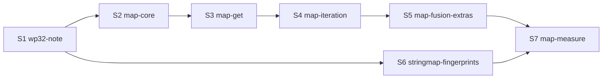

# WP32 — the global Map and Set

## Context

`Map` and `Set` do not exist (`docs/AI.md` "none of these exist"), and wp28 §4.1 names them the library tier's first need now that WP18 generics have landed. `self/map.ts`'s `StringMap` is the in-house precedent: an insertion-ordered bucket table of entry indices over a dense entry list. It compares the full key at every occupied bucket and rehashes every key on growth.

`tsconfig.json`'s `"lib": ["ES2022"]` already declares `Map` and `Set` for `tsc`, so `runtime/nish.d.ts` must not redeclare them.

## Decisions taken with the user

- **The global name, with JS semantics.** Insertion-order iteration, and SameValueZero keys: -0 is +0, and NaN is equal to NaN. The implementation is Nish code in `std/`, and the compiler knows what `Map` means.
- **Single lookups are a hard requirement, not a measurement outcome.**
  - Each bucket slot stores the entry index **and** a hash fingerprint.
  - A probe dereferences the entry list only on a fingerprint match, so a miss, and nearly every non-matching bucket, is one memory access.
  - Each entry stores its full hash, so growth and compaction never rehash.
  - Fusion and `getOrInsert` keep the first probe's result and write through it, so word count is one hash and one search.
- **`get`'s result type is decided by the design note (S1).** The Plan agent's evidence favours `V | undefined`, admitted narrowly and narrowed by `!== undefined` or `??`, because that is what `tsc` says. S3 implements what the note decides.
- **Iteration in v1:** `for...of` over `keys()`, `values()` and a `Set`. There is no `entries()` and no `forEach`, because there is no destructuring and a method cannot take a function parameter (NL2338).
- **In scope:** `Set`, compiler lookup fusion, `nish/map`'s `reserve` and `getOrInsert`, and the `StringMap` retrofit.
- **Not built:** an unordered map. S1 and S7 measure against an unordered prototype, and the note records whether one is ever needed.

## The measurement

The note's measurement item covers four comparisons. Each is measured against Node's `Map` and against the unordered (keys-in-buckets) layout:

| | comparison | stage |
|---|---|---|
| a | ordered with fingerprints vs unordered | S1 (prototypes) |
| b | fused vs double lookup on word count | S7 |
| c | presized (`reserve`) vs growing | S7 |
| d | the new map vs `StringMap` | S7 |

## Merge order

- The whole run starts after the wp29-p1 run has closed out. The two runs share `self/generics.ts`, `checker.ts`, `program.ts`, `emit.ts`, `attributes.ts`, `codes.ts`, `compilation.ts`, `std_modules.ts`, `bench/run.mjs`, `docs/BENCHMARKS.md` and `docs/LANGUAGE.md`.
- S2 to S5 are strictly sequential: they share `std/collections.ts`, `self/emit_map.ts`, `self/codes.ts` numbering and `tests/nish-cmp.js` `DECLARED`.
- S6's files are disjoint from theirs, so it runs concurrently after S1.
- **Regenerated stores belong to no stage.** Each stage regenerates `tests/self/goldens/*`, `tests/differential/goldens/unfrozen.txt` and `tests/perf-baseline.json` with the tooling after merging main.
- **`CHANGELOG.md` is generated.**

## Stage S1 — wp32-note

**Owns:**
- `docs/wp32-map.md` (new), `docs/MASTER_PLAN.md`;
- `bench/map_proto_ordered.ts`, `bench/map_proto_ordered_fp.ts`, `bench/map_proto_unordered.ts` and their `.args` (new), `bench/map_node.mjs` (new);
- `bench/run.mjs` (a `maps` group), `bench/README.md`;
- `tests/run.js` (the bench validate hunk only).

**The questions the note decides**, each with evidence:

- **`get`'s type:** `V | undefined` narrowly, or `has` + `get(k)!`, or something else. Whether a maybe value may be annotated or cross a call; if it may, it lowers to the WP17 `{i1, V}` shape.
- **Slot encoding:** an `i64` slot (`hash32<<32 | index+1`), or a packed `i32` (7–8 fingerprint bits plus an index cap). Where the full hash lives, and the load factor.
- **Output shape:** collection instances emitted into the instantiating module so that `-o x.ll` keeps working (`planOutputs`, `self/compile.ts:127`), or a separate module with the tests in `tests/link/`. Also the class names, and what a user-declared `Map` does.
- **Key types in v1:** strings, the integers, `f64`, `boolean`, enums and class identity. Refused: records, nullable and `Result`. Records as values are refused too (they are stored inline, `LANGUAGE.md` ~2514).
- **`delete`:** tombstones vs compaction, and the trigger.
- **Mutation during iteration:** exact JS semantics or weaker. Set's `keys`/`values`/`for...of`.
- **Small choices:**
  - `size` as `number`;
  - `set`/`add` returning `this`;
  - `new Set(array)`;
  - type-argument inference from an annotation.
- **Interop:** refuse, skip or opaque, for each sidecar.
- **The exact fusion patterns,** and what "nothing in between" means.
- **Hash functions per type;** hash flooding is out of scope for v1.
- **Whether a `Map` read may appear inside a wp29 parallel body.**

**Prototypes:** monomorphic `string→i32` and `i32→i32` tables in four layouts:
1. StringMap-style ordered;
2. ordered with an `i64` fingerprint slot;
3. ordered with a packed `i32` slot;
4. unordered.

Workloads are insert, hit, miss, word count and delete churn, driven by an in-program LCG with no I/O. A Node twin uses the global `Map`. The checksums must agree, and the numbers go in the note.

## Stage S2 — map-core

**Owns:**
- `std/collections.ts` (new), `std/README.md`;
- `self/compilation.ts`, `self/std_modules.ts`, `self/compile.ts` (output planning only), `self/declarations.ts`, `self/checker.ts`, `self/generics.ts`, `self/annotations.ts`, `self/members.ts`, `self/program.ts`, `self/emit.ts`, `self/emit_map.ts` (new), `self/interop_abi.ts`, `self/interop_dts.ts`, `self/interop_napi.ts`, `self/interop_header.ts`, `self/codes.ts`;
- `runtime/nish.d.ts` (comment only), `.github/workflows/release.yml` (the std gates only);
- `tests/cases/{map,set}_*`, `tests/cases/reject_{map,set}_*`, `tests/link/map_*/**`, `tests/wordings/*map*`, `tests/run.js` (the fingerprint check and `stdModuleNames` hunks), `tests/nish-cmp.js`, `examples/sets.ts` (new);
- `docs/LANGUAGE.md`, `docs/AI.md`, `docs/IR_COOKBOOK.md`, `docs/cookbook/map_*`, `docs/ARCHITECTURE.md`.

**The implementation:**
- `std/collections.ts` holds `class Map<K, V>` and `class Set<T>`, with the note's slot encoding and `hashes: u32[]` per entry.
- `probe` loads the slot word, compares the fingerprint, and reads `keys[]` only on a match, comparing the full stored hash before the key.
- It returns a packed result: the found entry index, or "absent at bucket b" plus the hash.
- `set` and `add` are one probe, with no has-then-set.

**Loading:** a "names `Map`/`Set`" flag drives an implicit import, synthesised as an `ImportBinding` bound through `bindStructTemplateImport` (`self/checker.ts` ~870/1018), unless the module declares its own `Map`. A program that does not name them loads nothing and is byte-identical.

**Intrinsics:** `hashKey<K>` and `sameKey<K>` are lowered per `K` in `self/emit_map.ts`, registered in wp29-p1's intrinsic table. Strings use FNV-1a; integers use a mixer; `f64` is normalised (-0 → +0, one canonical NaN) before `f64ToBits`; `boolean` and enums hash by value; class instances by pointer. The runtime budget has no room, so all of it is inline IR plus Nish.

**Surface:**
- Only the JS members are visible.
- `size` is read-only.
- `delete` is allowed as a member name.
- Named refusals, each with a new NL23xx code, a `reject_*` case and a wording:
  - the excluded key types;
  - record values;
  - `new Map` with arguments;
  - `entries` and `forEach`;
  - `get` (until S3);
  - a clashing user `Map`.
- Interop sidecars handle `Map`/`Set` as the note decides.

**The single-lookup check:** `tests/run.js` links `map_fingerprint_miss` with `-Wl,--wrap=nish_str_eq` and a counting shim. 10k absent string lookups must make **0** key compares, and 10k hits exactly **10k**. It skips through `skip()` when `ld.lld` is missing.

**Positive goldens:**
- one per key type, including `f64` -0 and NaN;
- insertion order after a delete;
- growth;
- a callee inserting into the caller's map across the #210 arena scopes;
- `-g`.

The f64 ones are also compared with Node through `unmodified.js`. `self/` does not use any of this (the rolling freeze).

## Stage S3 — map-get

**Owns:**
- `self/parser.ts`, `self/ast_text.ts`, `self/validator.ts`, `self/types.ts`, `self/expressions.ts`, `self/members.ts`, `self/emit_ops.ts`, `self/emit_control.ts`, `self/emit_map.ts`, `self/codes.ts`, `std/collections.ts`;
- `tests/parser_oracle.js`, `tests/parser/nullish*`, `tests/cases/map_get_*`, `tests/cases/reject_map_get_*`, `tests/cases/reject_nullish*`, `tests/wordings/*`, `tests/nish-cmp.js`;
- the S2 docs.

**If the note chose `V | undefined`:**
- Parse `??` with TypeScript's precedence (it does not mix with `||`/`&&` without parentheses). Any other `??` keeps NL1048.
- `undefined` is admitted only as an operand of `===`/`!==` against a `Map.get` result. Every other use keeps the validator refusal.
- The maybe value lives only in a `const` binding or a `??`, unless the note allows more.
- Narrowing reuses the nullable machinery.

**If the note chose otherwise,** implement that instead. Either way, `get` is one probe.

**Tests:** `map_get_nullish`, `map_get_narrow`, `map_get_pointer_value`, and about five `reject_*` cases.

## Stage S4 — map-iteration

**Owns:**
- `self/statements.ts`, `self/emit_arrays.ts` (the `emitForOf` dispatch), `self/emit_map.ts`, `self/bounds.ts`, `self/escape.ts`, `self/attributes.ts`, `self/arrays.ts`, `self/assignment.ts`, `self/checker.ts`, `self/codes.ts`, `std/collections.ts`;
- `tests/cases/{map,set}_iter_*`, `tests/cases/reject_map_iter_*`, `tests/nish-cmp.js`;
- docs.

**The walk:** an iteration kind in a side table. The walk re-reads the entry count each pass, skips dead entries, and follows the note's rule for `delete`/`set`/`clear` during the loop. `keys()`/`values()` are allowed only as a `for...of` iterable; a named refusal covers anything else.

**Tests:** order and every mutation-during-iteration case, compared against Node.

## Stage S5 — map-fusion-extras

**Owns:**
- `self/fusion.ts` (new), `self/members.ts`, `self/expressions.ts`, `self/program.ts`, `self/emit_map.ts`, `self/attributes.ts`, `self/escape.ts`, `self/generics.ts`, `self/std_modules.ts`, `self/codes.ts`;
- `std/map.ts` (new), `std/collections.ts`, `std/README.md`, `.github/workflows/release.yml` (the std gates);
- `examples/wordcount.ts` (new);
- `tests/cases/map_fused_*`, `tests/cases/map_extras_*`, `tests/cases/reject_map_extras_*`, `tests/link/map_extras_*/**`, `tests/run.js` (the probe-count hunk), `tests/nish-cmp.js`;
- docs.

**Fusion.** The checker recognises the note's patterns. At minimum:
- `m.set(k, E)`, where `E` contains exactly one `m.get(k)` or `m.has(k)` on the same local receiver and the same side-effect-free key, with no other call or assignment;
- a `has` guard whose branch begins with `get` or `set` on that key.

The emitter calls `probe` once and writes through its packed result with `valueAt`, `setValueAt` or `insertAt`, which reuses the stored hash. The fused callees are recorded in the attribute and escape facts.

**`std/map.ts`.** `reserve(m, n)` and `getOrInsert(m, k, v)` have Node-faithful bodies over `has`/`get`/`set`; `reserve` is a no-op under Node. Natively they are routed to `reserveSlots` and the single `probe`.

**The IR check.** The `map_fused_wordcount` loop body contains exactly **one** `probe` call and no `get`, `set`, `has` or second `hashKey` call. The same check runs for `getOrInsert`.

## Stage S6 — stringmap-fingerprints

**Owns:** `self/map.ts`, `tests/self/support_oracle.js`, `.claude/selfhost.md`.

**The change:**
- The note's slot encoding, in Nish-0 only, spelled as `i64` or parallel `i32` slots, whichever the seed compiles.
- Growth reads the stored hashes.
- `StringSet.add` becomes one probe.
- The compiler's output must not change: `tests/nish-cmp.js` shows no moved program, and the bootstrap reaches its fixed point.

**`Measured:` trailer:** the median of 10 stage2 compiles of `self/compile.ts`, and peak RSS, before and after.

## Stage S7 — map-measure

**Owns:**
- `bench/map_wordcount.ts`, `bench/map_presize.ts`, `bench/map_vs_stringmap.ts` and their `.args` (new);
- `bench/run.mjs`, `bench/README.md`;
- `docs/BENCHMARKS.md`, `docs/wp32-map.md`, `docs/MASTER_PLAN.md`;
- `tests/run.js` (the bench hunk).

**The measurement:** comparisons (b), (c) and (d), each natively and under Node, plus the S1 unordered prototype. Regenerate `BENCHMARKS.md` on a quiet machine, then write the note's §10: is an unordered map needed, and on what numbers?

## Out of scope

- building an unordered map;
- `entries()`, `forEach` and destructuring;
- `WeakMap` and `WeakSet`;
- iterators as values;
- hash-flooding resistance;
- using `Map` in `self/` (the rolling freeze);
- any change to `StringMap`'s API.

## Verification (every stage)

- `npm run check`;
- `npm test`, undegraded, with no skip beyond the three environmental ones;
- `npm run lint`, no worse than main;
- `node docs/check-links.mjs` when Markdown changes;
- the PR title passes `node scripts/changelog-gen.mjs --check-subject`.
