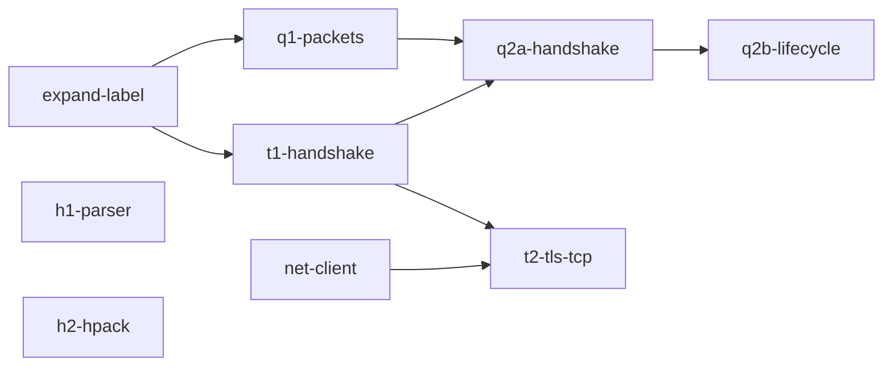

# WP34 wave 1 — the protocol stack's first lanes

## Context

[`docs/wp34-hosting-cs.md`](../../docs/wp34-hosting-cs.md) §5 splits the relay's protocol stack into lanes. K1–K5 have landed ([§5a](../../docs/wp34-hosting-cs.md)), along with K6's [`std/crypto/x509.ts`](../../std/crypto/x509.ts) and N5's `nish:net` (#341, #343, #349). So T1 and Q1 are unblocked, and H1's parser and HPACK never needed anything. Per decision S2 the stack is `std/`: modules `nish/net/tls`, `nish/net/quic-packet`, `nish/net/quic`, `nish/net/http1`, `nish/net/websocket` and `nish/net/hpack`, each with `tests/link/` cases. `nish:net` has no `connect` (#357), so a Nish program cannot yet be a TCP client.

## Approach

- **Sans-IO.** T1, Q1, H1 and HPACK take bytes and return bytes. Randomness (server random, the ephemeral key, connection ids) is an argument, so a test can inject the RFC trace's values. Only T2 and Q2 touch sockets.
- **Struct and `switch`**, not closures (§9). State is a class. Nothing allocates per packet once a connection is set up (N9's discipline). Ideally a state lives in a caller's slot.
- **RFC 8448 §3 signs with RSA-PSS**, which the stack does not have and which is randomised anyway. So T1 hands the CertificateVerify input to the caller and takes the signature back. Production signs `ecdsa_secp256r1_sha256` with K5. The RFC 8448 test checks the to-be-signed content, injects the trace's signature, and then checks every byte after it.
- **T1 covers ClientHello through client Finished.** NewSessionTicket (resumption) is out, as are 0-RTT and client authentication, as §5 says.
- **Interop that needs docker** (the quic-interop-runner, Autobahn, h2spec) stays out of `npm test`. S2 puts those suites in a CI job of their own, and a workflow edit is out of scope here. The end-to-end bar is a third-party client over loopback (openssl, curl, aioquic). The PR body shows the run. Each exchange is also replayed by a Nish client inside `npm test`, so CI checks it without the third party.
- **No new skips.** A test whose third-party tool is absent is not added to `npm test` as a skip. It lives in a script named in the PR body. `npm test` must stay undegraded.

### Ownership, and the shared files

Concurrent stages have disjoint `Owns`. Five files are shared on purpose, because the repository keeps one of each:

| file | rule |
|---|---|
| [`std/README.md`](../../std/README.md) | each stage adds only its own module's section, under one `## nish/net` heading (the first stage to merge creates it) |
| [`docs/wp34-hosting-cs.md`](../../docs/wp34-hosting-cs.md) | each stage adds or fills only its own row of §5a |
| [`tests/run.js`](../../tests/run.js) | net-client, t2 and q2* each add only their own `net_*` block |
| `tests/self/goldens/*` | regenerated with `node tests/self/goldens.js --update`, never edited |
| `THIRD_PARTY_NOTICES.md` | a row only if a stage copies code ([`.claude/licensing.md`](../../.claude/licensing.md)) |
| [`src/std-modules.ts`](../../src/std-modules.ts) `stdModuleNames()` | each stage adds only its own module names to the list (added 2026-10-02T22:35Z: the repo's checks require it for every new `std/` file) |
| [`.github/workflows/release.yml`](../../.github/workflows/release.yml) presence gates | each stage adds only its own `std/` file paths to the three presence lists, and updates the count in the message beside the first. Nothing else in the workflow changes (added 2026-10-02T22:35Z, same reason) |
| [`tests/nish-cmp.js`](../../tests/nish-cmp.js) `DECLARED` | each stage adds one narrow entry per new or changed program of its own (`program`, and `file` where only one file differs), with `changelog` set to its own PR subject as `scripts/changelog-gen.mjs` renders it (scope dropped, first letter raised, no `(#N)`). The 0.16.0 seed refuses every program that imports a module it does not have, so nish-cmp fails without them (added 2026-10-02T23:35Z, after #398 turned main red) |
| [`docs/security/README.md`](../../docs/security/README.md) index | each stage that creates a security record adds only its own row (added 2026-10-03T00:01Z: Q1 now creates `docs/security/quic.md` and T1 creates `tls.md` at the same time) |

When one of these conflicts, merge `main` into the branch and redo your own hunk. Do not resolve someone else's lines. Another `/feature` run (#394) is live and touches `runtime/runtime-net.c` (#355, #356) and `src/`, so net-client should expect conflicts the same way.

### Dependencies



Edges are merge order. T1 and Q1 start at once against the signature fixed below, and merge `main` once expand-label lands, which should take about an hour. T2 and Q2a start only once T1 (and, for Q2a, Q1) has merged, because they consume T1's interface. Q2b starts after Q2a merges.

## Stage expand-label

**Owns:** `std/crypto/hkdf.ts`, `tests/link/crypto_hkdf_expand_label*/**`, `docs/security/crypto-k1.md`

The signature, fixed so that T1 and Q1 can write against it before it merges:

```ts
export function hkdfExpandLabelSha256(secret: u8[], label: string, context: u8[], length: i32): u8[]
export function hkdfExpandLabelSha384(secret: u8[], label: string, context: u8[], length: i32): u8[]
```

`label` excludes the `"tls13 "` prefix, which the function adds (RFC 8446 §7.1). A length over 255, or a label over 249 bytes, is refused the way `hkdf.ts` refuses its other out-of-range lengths. Add a line to the K1 security record if it changes what that record says.

## Stage t1-handshake

**Owns:** `std/net/tls.ts`, `std/net/tls/**`, `tests/link/net_tls*/**`, `docs/security/tls.md`, `docs/security/README.md`, plus the shared-file hunks above.

- **Suites.** `TLS_AES_128_GCM_SHA256`, `TLS_AES_256_GCM_SHA384` and `TLS_CHACHA20_POLY1305_SHA256`, using K3, K2, K1 and expand-label. **Group:** x25519 (K4). **Signature:** `ecdsa_secp256r1_sha256` via the signing hand-off.
- **Extensions.** `supported_versions`, `key_share`, `supported_groups`, `signature_algorithms`, `server_name` (read and exposed), `application_layer_protocol_negotiation` (the server picks from a caller list, and no overlap is `no_application_protocol`), and `quic_transport_parameters` (opaque bytes in, opaque bytes out, carried only when the caller says the carrier is QUIC). Unknown extensions are ignored, but a duplicate is refused (RFC 8446 §4.2).
- **HRR.** If ClientHello offers x25519 in `supported_groups` but sends no x25519 share, the server answers with a HelloRetryRequest, applying the transcript's `message_hash` rule. A second miss is fatal.
- **Output by level.** The server emits handshake bytes tagged Initial, Handshake or Application, plus the traffic secrets as they become known. T2 wraps those bytes in records, and Q2 puts them in CRYPTO frames. That is what "carrier-agnostic" means here.
- **Refusals** are a TLS alert code, never a crash: a legacy version, no common suite, a bad Finished, a malformed length, a truncated message.
- **Secrets.** Per CLAUDE.md §Security, every function holding a handshake secret, the ECDHE secret or a traffic secret records it as unwiped in `docs/security/tls.md`, following ECC-2's form.

## Stage q1-packets

**Owns:** `std/net/quic-packet.ts`, `tests/link/net_quic_packet*/**`, `docs/security/quic.md` (created here; amended 2026-10-03T00:01Z because CLAUDE.md §Security requires the record for `quicKeys` and `quicKeyUpdateSecret` now, not when Q2a lands), plus the shared-file hunks.

QUIC v1 only (`0x00000001`). It covers the RFC 9000 §16 varint, the §17 long header (Initial, 0-RTT type parsed only, Handshake, Retry) and short header. It covers RFC 9000 §17.1 and A.2/A.3 packet-number encoding and recovery. It covers RFC 9001 §5.2 Initial secrets from the client's DCID, §5.3 AEAD packet protection, §5.4 header protection with K3's AES-ECB mask and K2's ChaCha20 mask, and the §5.8 Retry integrity tag with the v1 key and nonce. Every parse is bounds-checked against the datagram, and coalesced packets are split by length.

## Stage h1-parser

**Owns:** `std/net/http1.ts`, `std/net/websocket.ts`, `std/crypto/sha1.ts`, `tests/link/net_http1*/**`, `tests/link/net_websocket*/**`, `tests/link/crypto_sha1*/**`, plus the shared-file hunks.

- **SHA-1** exists only because RFC 6455 §4.2.2's accept key needs it. Its header says it is not for security. Standard base64 (not url) for the accept key goes in `websocket.ts`, reusing `nish/crypto/base64url`'s table if it can.
- **Parser.** It is incremental: feed any slice, get back "need more", a request head, body bytes or an error with its status (400, 413, 414, 431, 501, 505). It covers the RFC 9112 request line, header fields, `Content-Length` and `Transfer-Encoding: chunked` (reject both together), `Connection` keep-alive and close for 1.0 and 1.1, and `Upgrade`. Limits are caller-set numbers.
- **Writer.** A status line, headers, and a body either by length or chunked.
- **WebSocket.** Frame parse and encode, client masking, fragmentation, control-frame rules (≤125 bytes, never fragmented), close codes, and UTF-8 validation of text frames.

## Stage h2-hpack

**Owns:** `std/net/hpack.ts`, `tests/link/net_hpack*/**`, plus the shared-file hunks.

It covers the RFC 7541 §5.1 integer with an N-bit prefix, the §5.2 string with Huffman (Appendix B), the 61-entry static table, the dynamic table with size updates and eviction, all four representations (indexed, literal with incremental indexing, without indexing, never indexed), and an encoder whose Huffman choice is the caller's. The decoder refuses an index out of range, a padding over 7 bits or not all ones, an EOS symbol, an integer overflow, and a size update over the SETTINGS limit.

## Stage net-client

**Owns:** `runtime/runtime-net.c`, `runtime/nish.h`, `runtime/nish.d.ts`, `runtime/nish.mjs`, `runtime/shim.mjs`, `src/builtins.ts`, `src/emit-builtins.ts`, `src/nish-modules.ts`, `src/runtime.ts`, `docs/LANGUAGE.md`, `tests/cases/net_tcp_connect*`, `tests/cases/reject_net_connect*`, `tests/layout/**`, plus the shared-file hunks (including `tests/run.js` and the generated goldens).

`tcpConnect(addr: u8[]): i32` is a non-blocking `connect` on a new close-on-exec socket. It answers the descriptor, or a negative errno, with `-115` (EINPROGRESS) surfaced through the loop and not as a failure. `connectResult(fd: i32): i32` reads `SO_ERROR` once the descriptor is writable: 0, or the negative errno. Both functions are globals too, like the other sixteen. The kqueue branch compiles on Darwin. `runtime-net.c`'s measured `.text*` ceiling (2,304 against 2,071) is raised only by the measured amount, with the figure in the commit. Update #357 to say the first item has landed.

## Stage t2-tls-tcp

**Owns:** `std/net/tls/record*.ts`, `std/net/tls-tcp.ts`, `std/net/tls.ts` (re-exports only), `tests/link/net_tls_record*/**`, `tests/cases/net_tls*`, `docs/security/tls.md`, plus the shared-file hunks.

The record layer covers TLSPlaintext and TLSCiphertext (RFC 8446 §5), the per-record nonce, inner content type and padding, the 2^14 limit, alerts, KeyUpdate, and the change_cipher_spec compatibility record. The carrier is a server loop on `nish:net` that accepts, feeds T1, and then carries application data. Each connection is a slot reused from a pool sized at start-up (N9).

## Stage q2a-handshake

**Owns:** `std/net/quic.ts`, `std/net/quic-frame.ts`, `std/net/quic-conn*.ts`, `tests/link/net_quic_frame*/**`, `tests/link/net_quic_conn*/**`, `tests/cases/net_quic*`, `docs/security/quic.md`, `docs/security/README.md`, plus the shared-file hunks.

It covers the RFC 9000 §19 frames that the handshake and streams need (PADDING, PING, ACK, CRYPTO, NEW_TOKEN parse, STREAM, MAX_*, NEW_CONNECTION_ID, RETIRE_CONNECTION_ID, CONNECTION_CLOSE, HANDSHAKE_DONE), and CRYPTO reassembly per level. T1 runs over QUIC (RFC 9001 §4), with transport parameters both ways (§18), ACK generation per packet-number space, and the connection-id table. A simple bidirectional stream echo proves the 1-RTT data path, though full streams with flow control are Q4. Loss recovery is Q3: Q2a retransmits nothing beyond what the handshake needs to complete on loopback.

## Stage q2b-lifecycle

**Owns:** `std/net/quic*.ts` (other than quic-packet.ts), `tests/link/net_quic_*/**`, `tests/cases/net_quic*`, `docs/security/quic.md`, plus the shared-file hunks.

It covers Retry with an address-validation token that is HMAC'd and time-boxed, Version Negotiation for an unknown version, Stateless Reset (RFC 9000 §10.3) with the token derived from a static key, the idle timeout (§10.1), and key update (RFC 9001 §6) in both directions.

## Tests

| stage | case | proves |
|---|---|---|
| expand-label | `crypto_hkdf_expand_label` (+`_f64`) | RFC 8448 §3's derived secrets, and RFC 9001 A.1's client and server Initial keys, IVs and hp keys |
| t1 | `net_tls_rfc8448` | every RFC 8448 §3 secret (early, derived, handshake, c/s hs traffic, master, c/s ap traffic, exporter), the ServerHello, EncryptedExtensions, Certificate and Finished bytes, the CertificateVerify to-be-signed content, and acceptance of the trace's client Finished |
| t1 | `net_tls_ext_*` | ALPN choice and `no_application_protocol`, SNI exposed, transport parameters carried only for QUIC, HRR and its transcript (against RFC 8448 §5 where its primitives are in the stack, else a constructed vector), every refusal as its alert |
| t1 | `net_tls_ecdsa` | a production handshake signs with P-256, and the signature verifies with `p256VerifySha256` |
| q1 | `net_quic_packet_*` | RFC 9001 A.2 (client Initial), A.3 (server Initial), A.4 (Retry) and A.5 (ChaCha20 short header) built and opened byte for byte, and RFC 9000 A.1–A.3's varint and packet-number examples |
| h1 | `net_http1_*` | a corpus fed at every split point gives the same result as fed whole, chunked round trips, every refusal with its status, keep-alive rules for 1.0 and 1.1 |
| h1 | `net_websocket_*`, `crypto_sha1` | RFC 6455 §1.3's accept key (`dGhlIHNhbXBsZSBub25jZQ==` → `s3pPLMBiTxaQ9kYGzzhZRbK+xOo=`), the §5.7 example frames, control-frame refusals, and FIPS 180-4's SHA-1 examples |
| hpack | `net_hpack_*` | RFC 7541 C.1–C.6 encoded and decoded, with the dynamic table's entries and size after every step, and every decoder refusal |
| net-client | `net_tcp_connect` | a Nish client and a Nish server in one loop exchange bytes over loopback, a refused port answers `-111`, and the arena stays flat |
| t2 | `net_tls_record_*`, `net_tls_tcp` | RFC 8448 §3's encrypted records byte for byte, a record-boundary fuzz, `openssl s_client -tls1_3` and `curl` against a Nish server (run in `npm test`, since both are on CI's runners), and a Nish client replaying RFC 8448 §3 over loopback to a server with the trace's randomness injected |
| q2a/b | `net_quic_*` | an aioquic client (pip, run by a script named in the PR body) completing a handshake and echo, then Retry, VN, stateless reset, idle timeout and key update. Each exchange is recorded once with the server's randomness injected, and a Nish UDP client inside `npm test` replays it |

Every new module also passes the f64 build, as the crypto modules do (`*_f64`). A negative test exists for every stage.

## Out of scope

- 0-RTT, resumption and NewSessionTicket, client authentication, and the TLS client role (N13).
- The H1 and H2 servers on sockets, H2 frames, and the rest of H2. Only HPACK is here.
- Q3 (loss and congestion), Q4 (full streams and DATAGRAM), and R1/R2.
- New CI workflows for the interop runner, Autobahn and h2spec (S2's own job). They are follow-ups.
- The rest of #357 (batching, edge-triggered mode, timers, DNS, Windows and WASI).
- Changing any test threshold, ceiling or skip rule, except net-client's measured `.text*` ceiling.

## Verification

Every stage, before its PR:

- `npm run check`
- `npm test`, undegraded. Read the summary: 0 failed, no `DEGRADED:` banner, and the skip count no higher than on `main`.
- `npm run lint && npm run lint:dead`
- `node docs/check-links.mjs`
- The stage's own `node tests/run.js <name>` line, from its `verification` field.

The repository has no coverage tool. The substitute: every exported function is called by a `tests/link/` case, and every refusal has a case that reaches it.
